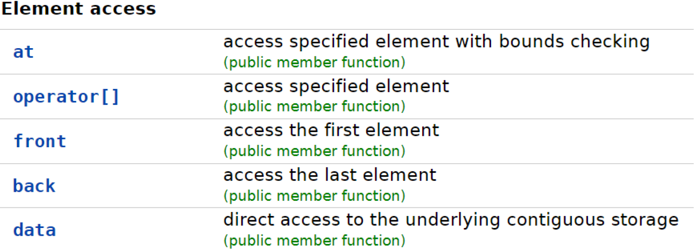
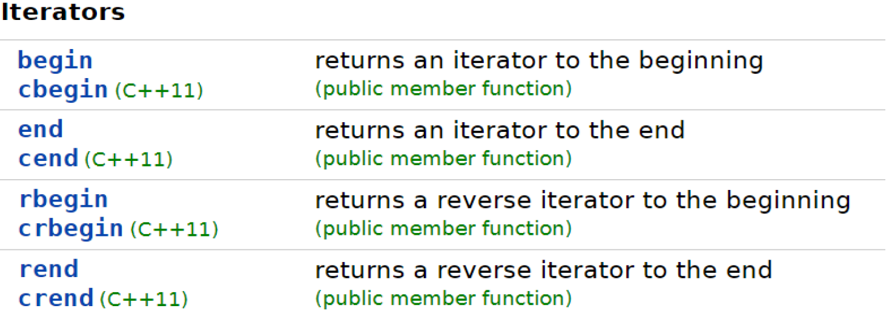
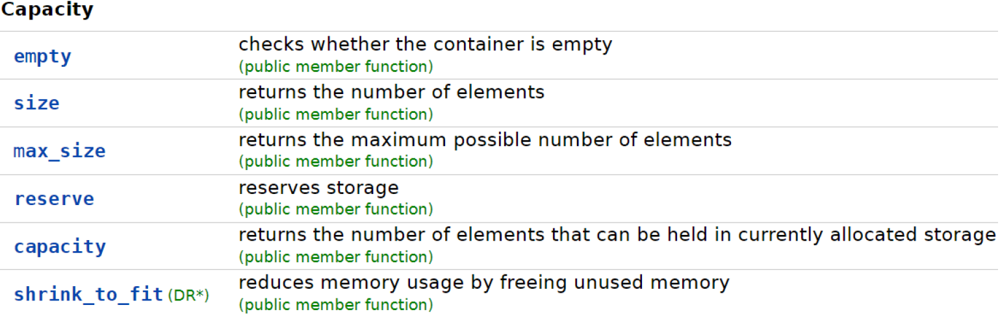
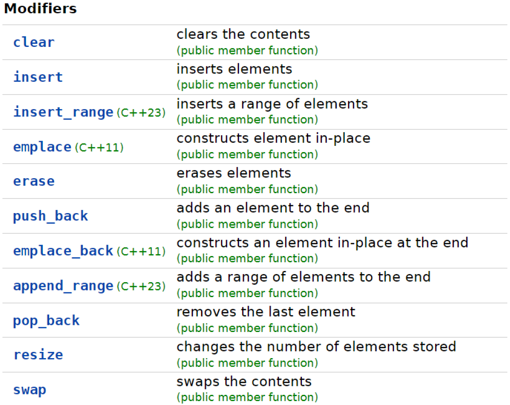

# Робота з динамічними масивами
**Мета**: Створити, відлагодити та протестувати програму, у якій створити клас для обробки даних. Одним з членів класу є масив структур, в якому зберігаються введені дані.

## Вказівки до роботи
Відповідно до цієї інструкції вам потрібно у середовищі Visual Studio Code з використанням набору компіляторів GCC створити програму мовою C++ з класом для обробки даних та реалізувати конструктор, деструктор, методи класу. Одним з членів класу є динамічний масив структур, в якому зберігаються введені дані. Також методи зміни полів класу повинні перевіряти валідність заданих змінних. Потрібно   реалізувати проєкт у середовищі Visual Studio Code для створення багатофайлових програм.
1. Ознайомитися із властивостями контейнера `std::vector` та його методами. Обдумати способи його використання для створення програм.
2. Вибрати завдання згідно свого варіанту у ДОДАТКУ.
3. Розробити блок-схему алгоритму програми.
4. Реалізувати програму для виводу даних полів (членів) масиву структур вкладених у клас.

## Короткі відомості
Введений в стандарт C++03, `std::vector` (або просто “вектор”) — це динамічний масив, який може сам керувати виділеною йому пам’яттю. Це означає, що ви можете створювати масиви, довжина яких задається під час виконання, без використання операторів new і delete (явної вказівки на виділення і звільнення пам’яті). `std::vector` знаходиться в заголовку `vector`. 
Оголошення `std::vector` відбувається таким чином:
```c++
#include <vector>
// Немає необхідності вказувати довжину при ініціалізації
std::vector<int> array; 
std::vector<int> array = {0}; 
std::vector<int> array2 = { 10, 8, 6, 4, 2, 1 }; // використовується список ініціалізаторів для ініціалізації масиву
std::vector<int> array3 { 10, 8, 6, 4, 2, 1 }; // використовується uniform-ініціалізація для ініціалізації масиву (починаючи з C++11)
```
Як і в неініціалізованому, так і в ініціалізованому випадках вам не потрібно явно вказувати довжину масивів. Це пов’язано з тим, що std::vector динамічно виділяє пам’ять для свого вмісту за запитом. Подібно `std::array`, доступ до елементів масиву може виконуватися як через оператор `[]` (який не виконує перевірку діапазону), так і через функцію `at()` (яка виконує перевірку діапазону).
Коли змінна-вектор виходить з області видимості, вона автоматично звільняє пам’ять, яку контролювала (займала). Це не тільки зручно (так як вам не потрібно це робити вручну), але також допомагає запобігти витокам пам’яті.
Детальніше про контейнер std::array можна дізнатися із онлайн довідника [std::vector - cppreference.com](https://en.cppreference.com/w/cpp/container/vector) 






## Хід роботи:
Рекомендації до роботи:
1. продумайте, які типи змінних вам потрібно використати для виконання завдання.
2. створіть проєкт із кількома файлами, тобто крім основного файлу, наприклад main.cpp, додайте два файли, наприклад `student.h` та `student.cpp`. Для цього потрібно виправити файл `..\.vscode\tasks.json`, а саме замість відносного шляху до виконуваного файла `"${file}"` вказати відносний шлях директорії проєкту до всіх файлів `/*.cpp`, `/*.h`, наприклад `"${workspaceFolder}/*.cpp","${workspaceFolder}/*.h"`:
```json
{
    "version": "2.0.0",
    "tasks": [
        {
            "type": "cppbuild",
            "label": "C/C++: g++.exe build active file",
            "command": "C:\\msys64\\ucrt64\\bin\\g++.exe",
            "args": [
                "-fdiagnostics-color=always",
                "-g",
                "${workspaceFolder}/*.cpp",
                "${workspaceFolder}/*.h",
                "-o",
                "${fileDirname}\\${fileBasenameNoExtension}.exe"
            ],
            "options": {
                "cwd": "${fileDirname}"
            },
            "problemMatcher": [
                "$gcc"
            ],
            "group": {
                "kind": "build",
                "isDefault": true
            },
            "detail": "compiler: C:\\msys64\\ucrt64\\bin\\g++.exe"
        }
    ]
}
```
3. У заголовному файлі `*.h` оголосіть клас:
```c++
class Student{
    private:
    std::vector<Student> students {0}; 
    …
}
```
4. оголосіть відповідну структуру, наприклад `student_s_t`, перед оголошенням класу:
```c++
struct student_s_t{
    int id;
    std::string name;
    int course;
};
```
5. реалізуйте для класу конструктор та деструктор.
6. реалізуйте методи класу для введення і виведення даних.
7. методи зміни полів класу повинні перевіряти валідність заданих змінних і попереджувати користувача про некоректні значення.
8. реалізуйте методи обробки даних: додавання, вставки, вилучення, обміну, очищення (видалення).
9. можете збільшити кількість членів класу додатковими полями чи методами.
10. програма має вивести на консоль (термінал) вхідні дані та результат виконання.

### Оформлення звіту
У звіті студент має вказати свій варіант індивідуального завдання та представити:
1. Блок-схему алгоритму програми.
2. Код (лістинг) програми.
3. Результати тестування для різних вхідних умов.
4. Конструктивний висновок — що ви дізналися нового, чого навчилися, якими способами та інструментами досягнули мети.

## ДОДАТОК

### Варіанти завдань

|  № |    Клас    |                          Поля класу                        |
|----|------------|------------------------------------------------------------|
|  1 | Студент    | Ім'я, курс, середній бал                                   |
|  2 | Службовець | Ім'я, вік, посада                                          |
|  3 | Іспит      | Ім'я студента, номер білета, оцінка                        |
|  4 | Адреса     | Ім'я, вулиця, номер будинку                                |
|  5 | Товар      | Назва, ціна, кількість                                     |
|  6 | Деталь     | Назва, артикул, ціна                                       |
|  7 | Книга      | Назва, автор, ціна                                         |
|  8 | Фільм      | Назва, режисер, рік виходу                                 |
|  9 | Робітник   | Ім’я, розряд, стаж роботи                                  |
| 10 | Квитанція  | Номер, дата, сума до сплати                                |
| 11 | Автомобіль | Марка, модель, рік випуску                                 |
| 12 | Країна     | Назва, площа, кількість населення                          |
| 13 | Компанія   | Назва, керівник, кількість працівників                     |
| 14 | Судно      | Назва, тип, водотоннажність                                |
| 15 | Тварина    | Назва, ряд, родина                                         |
| 16 | Літак      | Країна, призначення, статус експлуатації                   |
| 17 | Вантажівка | Марка, потужність двигуна, вантажопідйомність              |
| 18 | Авіалайнер | Авіалінії, виробник, кількість пасажирів                   |
| 19 | Команда    | Місто, рік заснування, тренер                              |
| 20 | Квиток     | Дата, вагон, місце                                         |
| 21 | Мова       | Група, система письма, кількість літер                     |
| 22 | Ноутбук    | Виробник, розмір діагоналі екрана, процесор                |
| 23 | Бокс       | Рік, переможець, переможений                               |
| 24 | Столиця    | Країна, кількість населення, площа                         |
| 25 | Стадіон    | Місто, команда, кількість місць                            |
| 26 | Поїзд      | Номер, пункт відправлення, пункт призначення               |
| 27 | Смартфон   | Модель, об’єм оперативної пам’яті, об’єм постійної пам’яті |
| 28 | Гонка      | Рік, пілот-переможець, команда-переможець                  |
| 29 | Річка      | Назва, довжина, площа басейну                              |
| 30 | Персона    | Ім’я, дата народження, вид діяльності                      |
